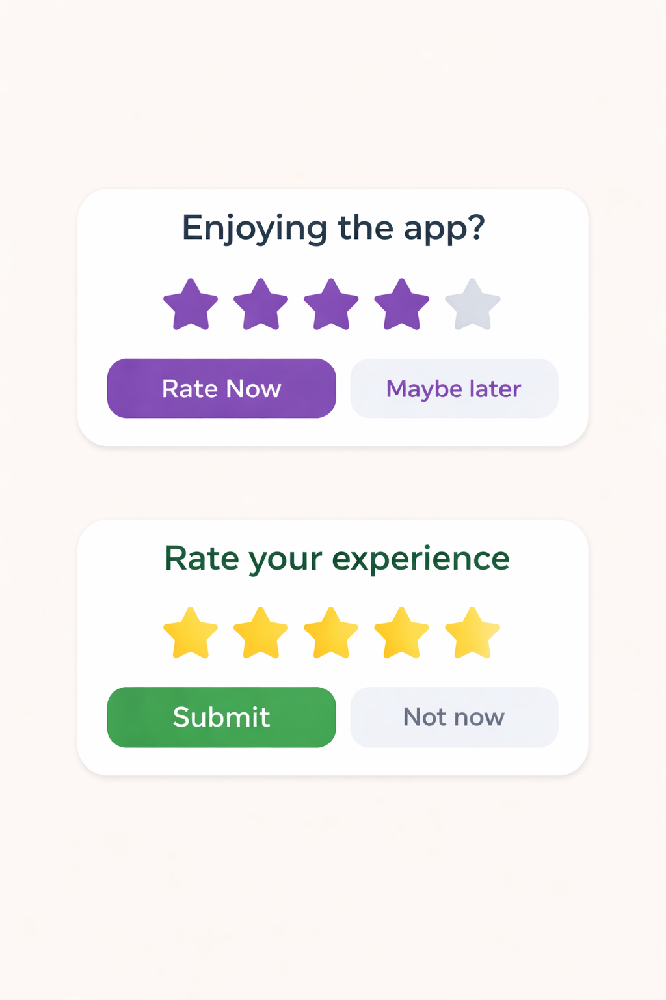

## App Rating Dialog
[](https://kotlinlang.org/)
[](LICENSE)
[](#)

A lightweight, customizable Android library to show a smart App Rating Dialog with modern UX and full control.

---

### Features

- Beautiful rating dialog UI

- Show dialog based on app launches & days

- Smart logic to avoid annoying users

- Remind later support

- Never show again option

- Fully customizable:

    - Title text

    - Button text

    - Star color

    - Button background color

- Redirect to Play Store

- Callback listeners for user actions

- Easy integration with Builder pattern

---

### Preview



---

## Installation

### Step 1: Add JitPack

```gradle
dependencyResolutionManagement {
    repositories {
        google()
        mavenCentral()
        maven { url 'https://jitpack.io' }
    }
}
```

### Step 2: Add Dependency

```gradle
dependencies {
	        implementation 'com.github.Excelsior-Technologies-Community:Android_AppRatingDialog:1.0.0'
	}
```

---

### Usage

Basic Usage
```kotlin
AppRatingDialog.Builder(this)
    .setDaysBeforePrompt(3)
    .setLaunchTimes(5)
    .build()
    .show()
```

Advanced Usage (Full Customization)
```kotlin
AppRatingDialog.Builder(this)
    .setDaysBeforePrompt(0)
    .setLaunchTimes(1)
    .setTitleText("Enjoying the app?")
    .setSubmitText("Rate Now ⭐")
    .setLaterText("Maybe later")
    .setNeverText("Don't ask again")
    .setStarColor(Color.YELLOW)
    .setButtonBackgroundColor(Color.parseColor("#6200EE"))
    .setRatingListener(object : RatingListener {
        override fun onRateClicked(rating: Float) {
            Log.d("Rating", "User rated: $rating")
        }

        override fun onLaterClicked() {
            Log.d("Rating", "User clicked later")
        }
    })
    .build()
    .show()
```

### Customization Options

| Feature         | Method                      |
|-----------------|----------------------------|
| Title           | `setTitleText()`           |
| Submit Button   | `setSubmitText()`          |
| Later Text      | `setLaterText()`           |
| Never Text      | `setNeverText()`           |
| Star Color      | `setStarColor()`           |
| Button Color    | `setButtonBackgroundColor()` |

---

### License

```
MIT License

Copyright (c) 2025 Excelsior Technologies 

Permission is hereby granted, free of charge, to any person obtaining a copy
of this software and associated documentation files (the "Software"), to deal
in the Software without restriction, including without limitation the rights
to use, copy, modify, merge, publish, distribute, sublicense, and/or sell
copies of the Software, and to permit persons to whom the Software is
furnished to do so, subject to the following conditions:

The above copyright notice and this permission notice shall be included in all
copies or substantial portions of the Software.

THE SOFTWARE IS PROVIDED "AS IS", WITHOUT WARRANTY OF ANY KIND, EXPRESS OR
IMPLIED, INCLUDING BUT NOT LIMITED TO THE WARRANTIES OF MERCHANTABILITY,
FITNESS FOR A PARTICULAR PURPOSE AND NONINFRINGEMENT. IN NO EVENT SHALL THE
AUTHORS OR COPYRIGHT HOLDERS BE LIABLE FOR ANY CLAIM, DAMAGES OR OTHER
LIABILITY, WHETHER IN AN ACTION OF CONTRACT, TORT OR OTHERWISE, ARISING FROM,
OUT OF OR IN CONNECTION WITH THE SOFTWARE OR THE USE OR OTHER DEALINGS IN THE
SOFTWARE.
```
